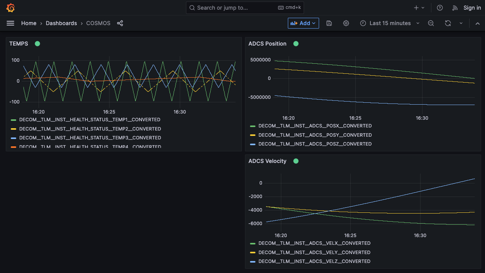
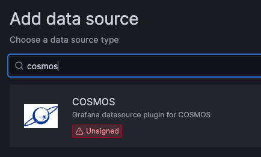
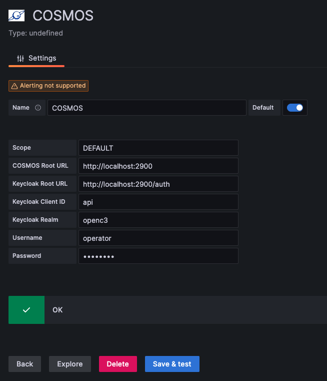
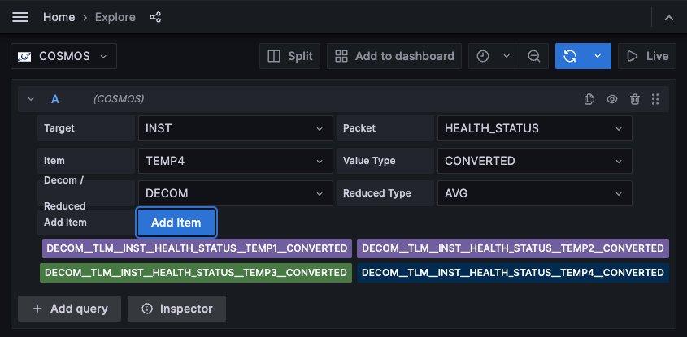
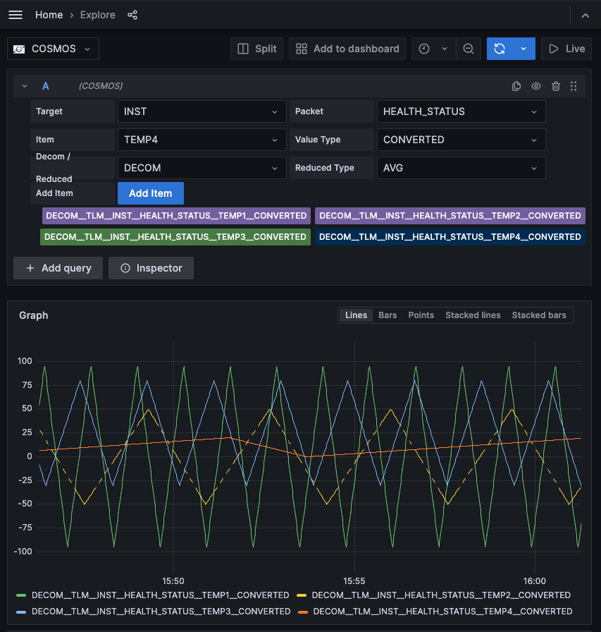

# OpenC3 COSMOS Grafana data source plugin

This plugin allows you to directly query your [OpenC3 COSMOS](https://openc3.com/) telemetry items and create live dashboards. The plugin supports both COSMOS Open Source as well as [COSMOS Enterprise Edition](https://openc3.com/docs/enterprise/).



## Installation

Currently the COSMOS plugin is not a signed plugin present in the Grafana plugin library. This prevents it from being used in Grafana Cloud. If you are an OpenC3 customer and would like to install COSMOS in Grafana Cloud please contact us at [support@openc3.com](mailto:support@openc3.com).

The easiest way to install the plugin is to grab the latest [release](https://github.com/OpenC3/grafana-cosmos-datasource/releases), unzip it, and mount it as a volume to the Grafana instance installed via the [compose.yaml](compose.yaml).

Grafana also has instructions on [local plugin installation](https://grafana.com/docs/grafana/latest/administration/plugin-management/#install-plugin-on-local-grafana).

## Usage

Once you've restarted Grafana after installing the plugin you should be able to search for COSMOS via Add Data Source.



Doulble click it to bring up the Data Source settings screen where you configure the COSMOS data source.



The following settings are available:

- Scope: The COSMOS [Scope](https://openc3.com/docs/enterprise/scopes) to query data from. Open Source is always 'DEFAULT' while Enterprise Edition can have multiple scopes.
- COSMOS Root URL: Root URL to access COSMOS.
- Keycloak Root URL: Root URL to access Keycloak. Enterprise Edition only which allows us to support external Keycloak installations.
- Keycloak Client ID: Name of the client ID in Keycloak. Enterprise Edition only which allows us to support external Keycloak installations.
- Keycloak Realm: Name of the realm in Keycloak. Enterprise Edition only which allows us to support external Keycloak installations.
- Username: Name of the COSMOS user. Open Source only has one user so this field should be blank. Enterprise Edition should enter the username of a valid Keycloak user.
- Password: User password. Open Source should enter the default user password created when COSMOS was installed. Enterprise Edition should enter the password for the given username.

Once you have configured the plugin click Save & Test and you should see the green OK checkbox. Then click Explore to start building queries.



Building a query is very similar to using COSMOS [Telemetry Grapher](https://openc3.com/docs/v5/tlm-grapher) or [Data Extractor](https://openc3.com/docs/v5/data-extractor). You select the Target, Packet, and Item you want to add to the graph. The Value Type is either Converted or Raw as graphing strings created from Formatted or With Units doesn't make sense. The Decom / Reduced field allows you to use the COSMOS data reduction feature by selecting REDUCED_MINUTE, REDUCED_HOUR, or REDUCED_DAY data. When one of the REDUCED data options are chosen the Reduced Type should also be selected to determine how to diplay the reduced data. Note that Reduced Type is not used when DECOM is selected. Reduced data is highly recommended when doing queries over large time spans.

Click Add Item to add the current item to the list of telemetry points that will be added to the graph. In the above example, I have added the 4 TEMP telemetry items from the COSMOS Demo. To remove an item simply click it.

Once you've added all your items, click the Blue refresh button to cause Grafana to execute the query and produce a sample graph.



At this point you can click Add to Dashboard and create dashboards in the usual manner.

## Developers

Developing the COSMOS Data Source plugin is very similar to installing it. You install the dependencies and run it in development mode which re-compiles any updates live. The Docker compose file mounts in the local development build directory and sets various options in the .config/Dockerfile to allow for live development.

1. Install dependencies

   ```bash
   yarn
   ```

2. Build plugin in development mode and run in watch mode

   ```bash
   yarn dev
   ```

3. Spin up a Grafana instance and mount the plugin inside it (using Docker)

   ```bash
   docker compose -f compose-dev.yaml up
   ```
